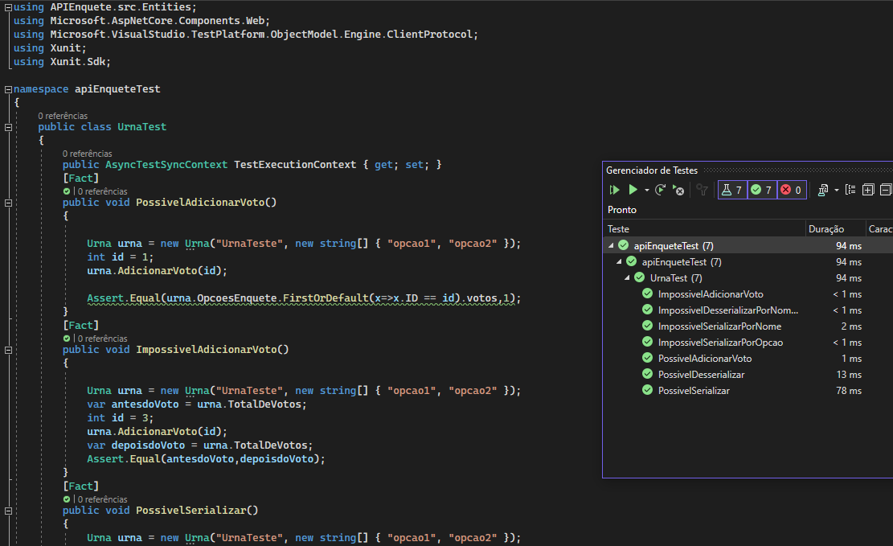

<body>
    <h1 align="center">Teste unitário do projeto "APIEnquete".</h1>  
    
Utilizando a linguagem de programção C#, utilizando Xunit, desenvolvi métodos para testar os métodos da classe Urna, com finalidade de garantir a qualidade de código, assim, mesmo em futuras refatorações, garantir que as alterações não quebrem o código.

    <h2>Atenção: para utilizar este teste, é necessário o Visual Studio.</h2>
    <h2>Também é necessáirio remover este arquivo de readme para este projeto de testes funcionarem.</h2>
    
Pelo Visual Studio Code fica impossibilitado de aplicar os teste.

    
    
Durante a execução dos testes, todos os métodos tem que ficar com essa marca positiva. Caso algum destes icones verdes apareçam em vermelho, é porque algum método ou atributo foi alterado na classe Urna do projeto de APIEnquete que resultou em erro de execução e comprometeu a qualidade do código.

</body>
